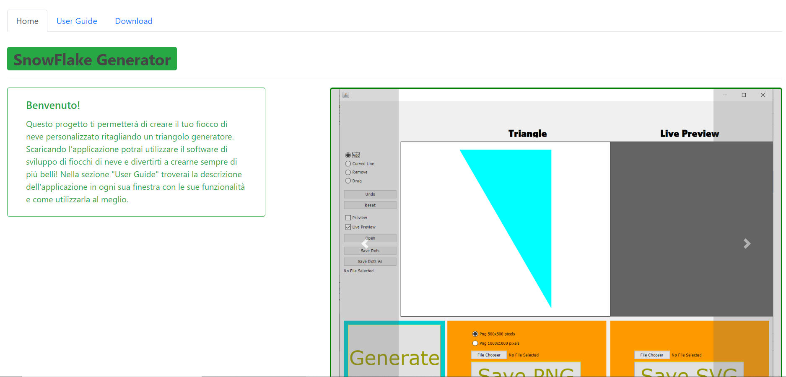
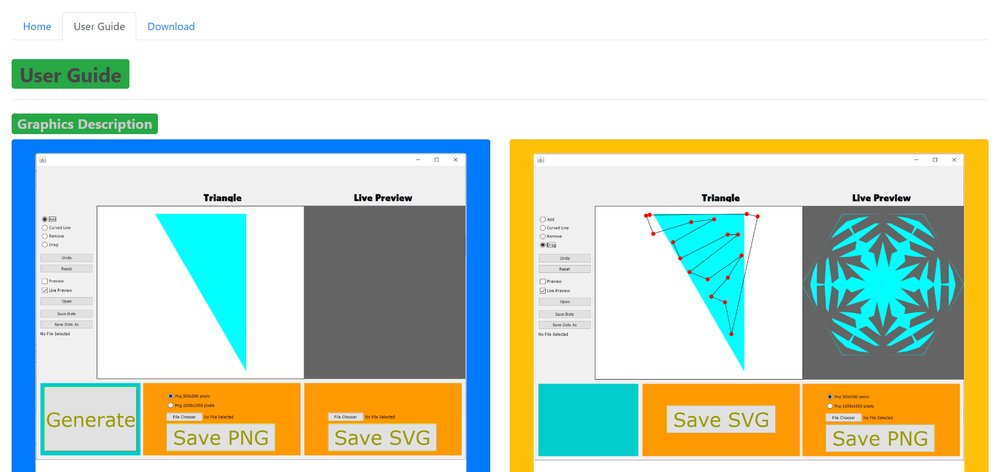
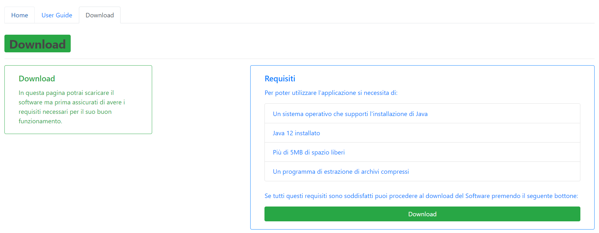
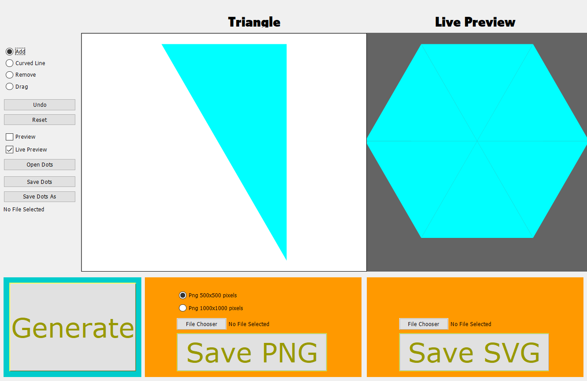
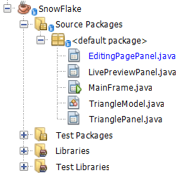
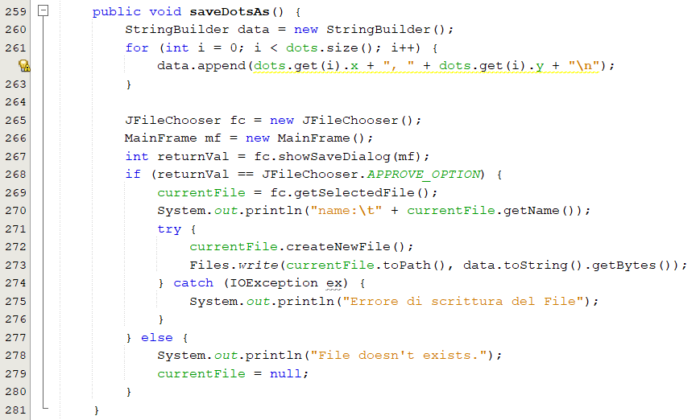
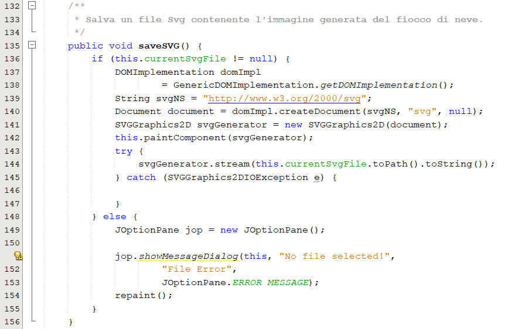
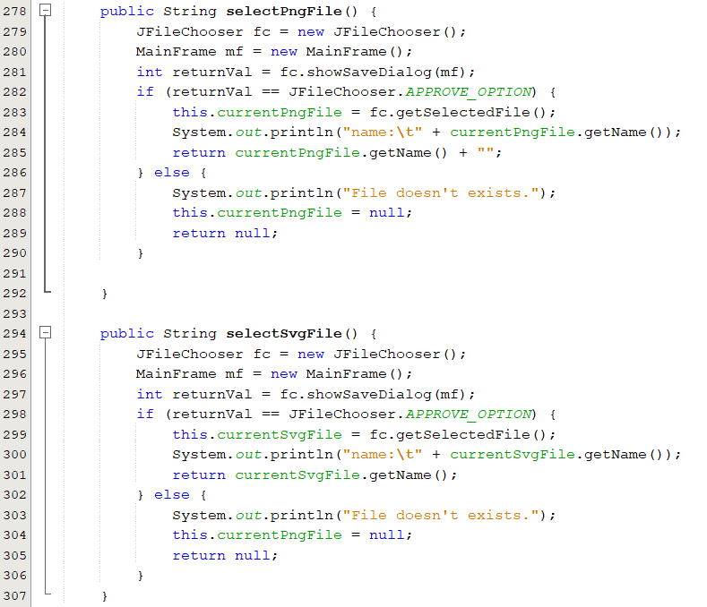

# SnowFlake

## Introduzione

### Informazioni sul progetto

  -   Nicholas Pigni

  - Docenti supervisori: Luca Muggiasca, Geo Petrini
  
  -   Scuola di Arti e Mestieri Trevano, Sezione Informatica

  -   Inizio del progetto: 06 Settembre 2019, consegna: 20 Dicembre 2019

### Abstract
  Il progetto SnowFlake tratta di un metodo di generazione grafica di fiocchi di neve tramite la modifica di un triangolo rettangolo generatore del nuovo fiocco. All'interno di esso si potranno trovare diverse modalita di modifica del triangolo ma ognuna sarà posta nell'ottica di ritagliarlo per poi ruotarlo e specchiarlo nel modo corretto allo scopo di generare un fiocco di neve personalizzato.

  L'intera applicazione è sviluppata in Java, perciò compatibile con tutte le piattaforme supportanti questo linguaggio o in grado di interpretarlo.

### Scopo
  Lo scopo di questo progetto è principalmente creativo e ricreativo, tramite questo sarà possibile non solo creare il proprio fiocco di neve personalizzato ma anche 

  Lo scopo del progetto (scopi didattici/scopi operativi). Dovrebbe
  descrivere il mandato, ma non vanno ricopiate le informazioni del
  quaderno dei compiti (che va invece allegato).

## Progettazione

### Diagramma UML
Il diagramma UML delle classi con le loro relazioni:

### Requisiti 

|ID|Requisito|Categoria|Priorità|Versione|
|--|---------|---------|--------|--------|
|001|Creazione del sito web dal quale si scaricherà l'applicativo|Web|Bassa|0.0|
|002|L'applicazione deve essere fornita in JAR per essere eseguita|Web|Media|0.0
|003|Il triangolo deve essere sempre centrato|Applicazione|Media|0.0|
|004|Il triangolo deve ridimensionarsi in base alla finestra, la sua grandezza è al 50% all'apertura della finestra|Applicazione|Bassa|0.0|
|005|I punti di taglio sul fiocco sono da inserire con un click sinistro del mouse|Applicazione|Bassa|0.0|
|006|L'utente può creare più di un poligoni di taglio|Bonus|Media|0.0|
|007|La pagina deve presentare un tasto di reset totale dei punti di taglio|Applicazione|Media|0.0|
|008|I punti di taglio possono essere rimossi cliccandoci sopra con il mouse|Bonus|Bassa|1.0|
|009|I punti di taglio possono essere trascinati con un Drag del mouse|Bonus|Bassa|0.0|
|010|Deve essere possibile il salvataggio dei punti di taglio per permettere modifiche o rigenerazioni future|Applicazione|Media|0.0|
|011|Deve essere possibile aprire un file di salvataggio dei punti di taglio|Applicazione|Media|0.0|
|012|La modellazione del fiocco avviene in tempo reale|Bonus|Bassa|0.0|
|013|Deve essere presente un tasto "Genera" che crea l'anteprima del fiocco di neve|Applicazione|Alta|0.0|
|014|Il salvataggio del fiocco di neve deve essere possibile scegliendo il percorso|Applicazione|Alta|0.0|
|015|Il salvataggio del fiocco deve essere possibile come immagini Raster (PNG: 500p x 500p o 1000p x 1000p) e Vettoriale (SVG)|Applicazione|Alta|0.0|
|016|La finestra deve essere ridimensionabile e le sue dimensioni minime sono di 1024p x 768p|Applicazione|Media|0.0|
|017|La pagina deve presentare i requisiti minimi che l'applicazione necessita per funzionare correttamente|Web|Media|0.0|
|018|La pagina deve contenere una guida utente che presenta le funzionalità dell'applicazione, possibilmente con degli screenshots|Web|Media|0.0|

### Design GUI

#### Web Page

Quando l'utente accederà al sito web dedicato verrà visualizzata per prima la pagina Home, costituita da una breve descrizione del programma e delle slides di immagini come presentazione:

In seguito potrà passare alla pagina seguente, quella con la Guida Utente.
In questa pagina vengono mostrate delle immagini complete di descrizioni che illustrano i vari funzionamenti di tutte le funzionalità del programma cosicché anche gli utenti meno esperti possano godere del servizio senza problemi.

Nella terza e ultima pagina si potranno invece trovare i requisiti minimi che dovrà avere il sistema dove verrà installata l'applicazione e il bottone di download del file eseguibile. 

#### Application GUI
Questa è il design scelto per l'applicazione vera e propria. Ho scelto di dividere tutto in pannelli con un layout "Border Layout" in modo da avere al centro lo spazio per l'editing del fiocco mentre ai lati i vari menu per modificare la modalità di editing, salvare il fiocco o salvare i punti di taglio.

## Implementazione

Per la creazione di quest'applicazione ho scelto di utilizzare Apache Netbeans IDE 11.1. 
Per iniziare ho creato un JFrame (MainFrame.java) sul quale viene disegnato il pannello principale, quello della pagina di editing (EditingPagePanel.java), che a sua volta contiene i pannelli del triangolo (TrianglePanel.java), dell'anteprima live (LivePreviewPanel.java) e ai lati i menu di editing e salvataggio del lavoro. 
Ho anche creato la classe "TriangleModel.java" contenente il modello del triangolo stampato sullo schermo allo scopo di poter effettuare il resizing di esso partendo dalla grandezza dedl pannello in cui è contenuto, tutto questo mantenendolo centrato in altezza e larghezza. Il modello contiene anche le informazioni dei punti di taglio, mantenendone la posizione relativa al triangolo durante l'ingrandimento o la restrizione del pannello. 
L'unica classe che gestishce i dati del triangolo e che trasforma i click del mouse in punti quindi è "TrianglePanel.java".

### Descrizione dei metodi principali
I metodi principali che permettono il corretto funzionamento dell'applicazione sono quelli di gestione dei dati del triangolo e dei punti di taglio.

#### Salvataggio punti

Questo metodo mi permette di creare un file di salvataggio in formato csv e scriverci sopra i dati relativi ai punti di taglio del triangolo. 
Innanzitutto inserisco in una variabile di tipo StringBuolder i dati (riga per riga) dei punti formattati in csv (coordinata x, coordinata y).  
In seguito creo una finestra di dialogo di tipo JFileChooser per far scegliere all'utente il percorso del file da salvare.
Se l'utente ha scelto correttamente creo il file e ci inserisco la variabile data.
 
 
 

#### Salvataggio del triangolo in formato SVG

Per poter permettere il salvataggio del fiocco in formato SVG ho scelto di utilizzare la libreria "batik", una volta importata ho utilizzato i suoi metodi all'interno del mio. 
La creazione di un file SVG necessita di un elemento di tipo SVGGraphics2D come previsto nella libreria esterna e di richiamare questo come argomento del metodo paint utilizzato nel JPanel corrente (quello del quale si vuole salvare il contenuto).  
Per finire ho salvato il file nella destinazione scelta dall'utente tramite il bottone "File Chooser", se il percorso non è ancora stato impostato apparirà un'avviso che impedisce il salvataggio.
 
 

#### Salvataggio del triangolo in formato PNG

Allo scopo di aiutare la lettura e la stesura del codice ho creato due metodi di supporto che servono per richiedere all'utente il percorso del file da salvare, questi inseriscono in due differenti variabili globali di tipo File le proprietà del file selezionato tramite JFileChooser.
 
 
 
 
 
 
 
 
 
 
 
 

## Test

### Protocolli di test

|Test Case      | TC-001                               |
|---------------|--------------------------------------|
|**Nome**       |Il triangolo si ridimensiona rimanendo centrato, i punti di taglio di conseguenza|
|**Riferimento**|REQ-003, REQ-004  |
|**Descrizione**|Ridimensionare la finestra per verificare che il ridimensionamento e il centramento avvenga correttamente|
|**Prerequisiti**|Download e installazione dell'applicazione|
|**Procedura**     |<ul> <li>Avviare l'applicazione</li><li>Provare ad inserire un paio di punti in modo casuale sul triangolo</li><li>Ingrandire la finestra il più possibile</li> </ul>|
|**Risultati attesi** |Il triangolo si ridimensiona correttamente mantenendo le proporzioni e la centratura|
---
---
|Test Case      | TC-002                               |
|---------------|--------------------------------------|
|**Nome**       |Inserimento con il tasto sinistro del mouse dei punti di taglio|
|**Riferimento**|REQ-005                               |
|**Descrizione**|Inserire i punti di taglio del triangolo con il tasto sinistro del mouse|
|**Prerequisiti**|Download e installazione dell'applicazione|
|**Procedura**     |<ul> <li>Avviare l'applicazione</li><li>Verificare che nel menu sulla sinistra sia selezionato il radio button "Add"</li><li>Inserire i punti di taglio con il tasto sinistro nell'area del pannello del triangolo</li> </ul>|
|**Risultati attesi** |I punti vengono inseriti posizionati centralmente rispetto alla posizione del mouse al momento del click|
---
---
|Test Case      | TC-003                               |
|---------------|--------------------------------------|
|**Nome**       |Inserimento con il tasto sinistro del mouse dei punti di taglio|
|**Riferimento**|REQ-005                               |
|**Descrizione**|Inserire i punti di taglio del triangolo con il tasto sinistro del mouse|
|**Prerequisiti**|Download e installazione dell'applicazione|
|**Procedura**     |<ul> <li>Avviare l'applicazione</li><li>Verificare che nel menu sulla sinistra sia selezionato il radio button "Add"</li><li>Inserire i punti di taglio con il tasto sinistro nell'area del pannello del triangolo</li> </ul>|
|**Risultati attesi** |I punti vengono inseriti posizionati centralmente rispetto alla posizione del mouse al momento del click|
---
---
|Test Case      | TC-004|
|---------------|------------------------------|
|**Nome**       |La pagina presenta un tasto di reset dei punti di taglio |
|**Riferimento**|REQ-007                               |
|**Descrizione**|Resettare totalmente i punti di taglio del triangolo tramite un bottone apposito|
|**Prerequisiti**|Download e installazione dell'applicazione|
|**Procedura**     |<ul> <li>Avviare l'applicazione</li><li>Inserire qualche punto di taglio per renderne possibile la cancellazione</li><li>Cliccare il bottone "Reset" nel menu di sinistra</li> </ul>|
|**Risultati attesi** |Tutti i punti di taglio vengono cancellati e non sono più visibili|
---
---
|Test Case      | TC-005                               |
|---------------|--------------------------------------|
|**Nome**       |Rimozione dei punti di taglio|
|**Riferimento**|REQ-008                               |
|**Descrizione**|I punti di taglio possono venire rimossi tramite un click del mouse|
|**Prerequisiti**|Download e installazione dell'applicazione|
|**Procedura**     |<ul> <li>Avviare l'applicazione</li><li>Inserire qualche punto di taglio per renderne possibile la cancellazione</li><li>Selezionare il radio button "Remove" nel menu di destra</li><li>Cilccare su un punto nell'area rossa per cancellarlo</li> </ul>|
|**Risultati attesi** |I punti di taglio cliccati vengono cancellati|
---
---
|Test Case      | TC-006                               |
|---------------|--------------------------------------|
|**Nome**       |Trascinamento dei punti di taglio|
|**Riferimento**|REQ-009                               |
|**Descrizione**|I punti di taglio possono essere trascinati con un Drag del mouse|
|**Prerequisiti**|Download e installazione dell'applicazione|
|**Procedura**     |<ul> <li>Avviare l'applicazione</li><li>Inserire qualche punto di taglio per renderne possibile la cancellazione</li><li>Selezionare il radio button "Drag" nel menu di destra</li><li>Tracinare un punto prendendolo dall'area rossa</li> </ul>|
|**Risultati attesi** |I punti di taglio trascinati si cambiano posizione in base a quella del mouse fino a quando non viene rilasciato|
---
---
|Test Case      | TC-007                               |
|---------------|--------------------------------------|
|**Nome**       |Salvataggio dei punti di taglio|
|**Riferimento**|REQ-010, REQ-014                          |
|**Descrizione**|I punti di taglio possono essere salvati tramite file csv per permettere una rigenerazione futura del fiocco di neve|
|**Prerequisiti**|Download e installazione dell'applicazione|
|**Procedura**     |<ul> <li>Avviare l'applicazione</li><li>Inserire qualche punto di taglio per renderne possibile il salvataggio</li><li>Cliccare sul bottone "Save Dots" o "Save Dots As" nel menu di sinistra</li><li>Si aprirà una finestra di salvattaggio</li><li>Inserire il nome desiderato (inserendo ".csv" alla fine)</li><li>Premere save</li> </ul>|
|**Risultati attesi**|I punti di taglio vengono salvati in un file in formato csv|
---
---
|Test Case      | TC-008                               |
|---------------|--------------------------------------|
|**Nome**       |Apertura file di salvataggio dei punti di taglio|
|**Riferimento**|REQ-011                               |
|**Descrizione**|Si può aprire un file csv per importare dei punti di taglio precedentemente salvati|
|**Prerequisiti**|Download e installazione dell'applicazione|
|**Procedura**     |<ul><li>Avviare l'applicazione</li><li>Cliccare il bottone "Open Dots" nel menu di sinistra</li><li>Cercare e selezionare il proprio file di salvataggio</li><li>Cliccare il tasto open in basso a destra</li> </ul>|
|**Risultati attesi** |I punti di taglio precedentemente salvati in formato csv vengono caricati nel progetto e sono pronti per essere modificati|
---
---
|Test Case      | TC-009                               |
|---------------|--------------------------------------|
|**Nome**       |Anteprima in tempo reale del fiocco generato|
|**Riferimento**|REQ-012                               |
|**Descrizione**|È possibile visualizzare un'anteprima in tempo reale del fiocco che verrà generato mentre vengono inseriti i punti di taglio sul triangolo|
|**Prerequisiti**|Download e installazione dell'applicazione|
|**Procedura**     |<ul><li>Avviare l'applicazione</li><li>Inserire dei punti di taglio</li><li>Osservare il panel "Live Preview" sulla destra ad ogni click del mouse</li></ul>|
|**Risultati attesi** |Il fiocco viene generato ad ogni click del mouse e visualizzato nel pannello "Live Preview"|
---
---
|Test Case      | TC-010                               |
|---------------|--------------------------------------|
|**Nome**       |Presenza di un tasto "Genera" che genera l'anteprima del fiocco di neve generato|
|**Riferimento**|REQ-013                               |
|**Descrizione**|È possibile visualizzare un'anteprima del fiocco che verrà generato premendo il bottone "Genera"|
|**Prerequisiti**|Download e installazione dell'applicazione|
|**Procedura**     |<ul><li>Avviare l'applicazione</li><li>Inserire dei punti di taglio</li><li>Cliccare il tasto "Genera" in basso a sinistra</li></ul>|
|**Risultati attesi** |Appare un JFrame con il fiocco di neve generato|
---
---
|Test Case      | TC-011                               |
|---------------|--------------------------------------|
|**Nome**       |Possibilità di salvataggio del fiocco come immagine Raster 500x500px o 1000x1000px oppure come immagine svg|
|**Riferimento**|REQ-015                               |
|**Descrizione**|È possibile salvare il fiocco generato come immagine Raster 500x500px o 1000x1000px oppure come immagine svg|
|**Prerequisiti**|Download e installazione dell'applicazione|
|**Procedura**     |<ul><li>Avviare l'applicazione</li><li>Inserire dei punti di taglio</li><li>Scegliere se salvare il fiocco in png o svg</li><li>Per salvare in svg<ul><li>Scegliere il percorso di salvataggio tramite il bottone "File Chooser" nel riquadro in basso a destra (il riquadro del salvataggio svg)</li><li>Premere il bottone "Save SVG"</li></ul></li><li>Per salvare in png<ul><li>Selezionare la grandezza desiderata (500x500px o 1000x1000x) scegliendo uno dei due radio button presenti nel riquadro del salvataggio in png</li><li>Scegliere il percorso di salvataggio tramite il bottone "File Chooser" nel riquadro in basso a destra (il riquadro del salvataggio ong)</li><li>Premere il bottone "Save PNG"</li></ul></li></ul>|
|**Risultati attesi** |Il fiocco viene salvato come file PNG (500x500px o 1000x1000px) o come file svg|
---
---
|Test Case      | TC-012                               |
|---------------|--------------------------------------|
|**Nome**       |Grandezza minima della finestra di 1024p x 768p|
|**Riferimento**|REQ-016                               |
|**Descrizione**|La grandezza della finestra non diminuisce sotto i 1024 x 768 pixels|
|**Prerequisiti**|Download e installazione dell'applicazione|
|**Procedura**     |<ul><li>Avviare l'applicazione</li><li>Rimpicciolire la finestra</li></ul>|
|**Risultati attesi** |La finestra non si ridimensiona sotto i 1024 x 768 pixels|
---
---
|Test Case      | TC-013                               |
|---------------|--------------------------------------|
|**Nome**       |Descrizione requisisti minimi per poter utilizzare l'applicazione|
|**Riferimento**|REQ-017                               |
|**Descrizione**|La pagina WEB presenta i requisiti minimi necessari per poter utilizzare l'applicazione|
|**Prerequisiti**|Connessione al sito web|
|**Procedura**     |<ul><li>Entrare nel sito WEB</li><li>Passare al tab "Download"</li><li>Sulla destra vi è presente una lista di requisiti necessari per poter utilizzare l'applicazione</li></ul>|
|**Risultati attesi** |La lista é presente e leggibile sul sito|
---
---
|Test Case      | TC-014                                 |
|---------------|--------------------------------------|
|**Nome**       |Guida utente|
|**Riferimento**|REQ-018                               |
|**Descrizione**|L'utente può consultare la guida utente per poter utilizzare al meglio l'applicazione|
|**Prerequisiti**|Connessione al sito web|
|**Procedura**     |<ul><li>Entrare nel sito WEB</li><li>Passare al tab "User Guide"</li><li>All'interno di questo tab è presente la guida con tutte le informazioni necessarie</li></ul>|
|**Risultati attesi** |L'utente può trovare tutte le informazioni di cui ha bisogno all'interno della pagina web|
---
---
|Test Case      | TC-015                                 |
|---------------|--------------------------------------|
|**Nome**       |L'applicazione è fornita in JAR|
|**Riferimento**|REQ-002                               |
|**Descrizione**|L'applicazione è fornita in JAR per poter essere eseguita|
|**Prerequisiti**|Connessione al sito web|
|**Procedura**     |<ul><li>Entrare nel sito WEB</li><li>Passare al tab "Download"</li><li>All'interno di questo tab è presente la sezione "Requisiti" con all'interno il tasto "Download"</li><li>Cliccarlo e scegliere la destinazione del file</li><li>Verrà scaricato un archivio ".rar", aprirlo ed estrarre la cartella "SnowFlake"</li><li>Avviare l'applicazione "SnowFlake.jar" all'interno della cartella estratta</li></ul>|
|**Risultati attesi** |L'utente può scaricare ed avviare l'applicazione dal sito web in formato JAR|

## Consuntivo

Per il consuntivo consultare il Gantt Consuntivo all'interno della documentazione.

## Conclusioni

### Sviluppi futuri
  Questo progetto potrà sicuramente avere degli sviluppi futuri, magari contenenti nuovi metodi di salvataggio oppure aggiornamenti con features grafiche come la possibilità di scegliere il colore di ogni elemento della pagina (il fiocco o il triangolo) oppure aggiungere la possibilità di modificare un fiocco di neve già generato e salvato.
  Gli sviluppi sono molteplici.

### Considerazioni personali
  Sono contento e soddisfatto del risultato finale, il programma prodotto insieme a tutta la documentazione è stato un buon esercizio a scopo didattico per imparare a creare un prodotto finito da vedere in futuro ad un cliente.
  Durante il progetto ci sono state svariate situazioni di panico o di difficoltà, sono sempre riuscito a cercare le informazioni necessarie al raggiungimento dello scopo e di reperirle in fretta per non ritardare troppo sulla tabella di marcia. Molto utili sono stati gli aiuti dei compagni e dei professori, che si sono rivelati fonti rapide e attendibili; tuttavia ho imparato a selezionare le informazioni che ritenevo stilisticamente più in ordine anche derivanti da siti web e forum. 
  La corretta gestione del tempo e delle risorse è stata fondamentale per il raggiungimento dell'obbiettivo finale.

## Allegati

Elenco degli allegati:

-   Diari di lavoro: cartella "Diari"

-   Codice sorgente: cartella "SnowFlake Project"

-   Pagina Web: cartella "Web Page"